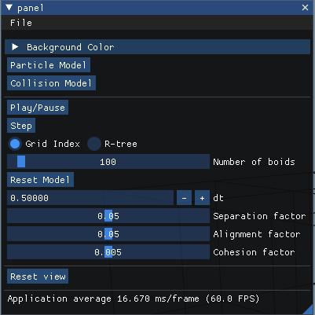

# Boids Simulation

This is the fifth assignment of CPSC 687 (Animation) course held in winter 2022 semester at the University of Calgary. 
In this assignment, I implemented flocks simulation based on the 
"***Flocks, Herds, and Schools: A Distributed Behavioral Model***" article by Craig W. Reynolds.

## Particle

Each Particle has these attributes.

- `position` (vec3f)
- `Velocity` (vec3f)
- `initialPosition` (vec3f) -> useful for resetting the model
- `isBarrier` (bool) -> used this attribute to make a boid stationary that works as a barrier.

And some methods.

- `applyForce(vec3f force, float dt)`

  This function applies force on the particle by changing its velocity based on its mass.

- `applyVelocity(float dt)`

  This function moves the particle based on its velocity.

- `applyVelocityLimit(float maxSpeed)`

  This function scales the velocity down to the max speed.


## Model

each model has a vector of particles and a set of attributes related to the model

- `std::vector<std::shared_ptr<Particle>> particles`
- `bounds = 30` The limits of cube (-30 to +30)
- `velocityLimit = 3` 
- `turnFactor = 0.2` The acceleration of each axis speed
- `separationRadius = 2`
- `separationAngle = M_PI * (1.f/2.f)`
- `separationConstant = 1`
- `alignmentRadius = 4`
- `alignmentAngle = M_PI`
- `alignmentConstant = 1`
- `cohesionRadius = 3`
- `cohesionAngle = M_PI`
- `cohesionConstant = 1`

All three constants are controllable via GUI.

### Step function

Step function, moves all particles on step in the time. This function is like below pseudocode.

```c++
virtual void step(float dt) {
    float maxRadius = std::max(separationRadius, std::max(alignmentRadius, cohesionRadius));
    SpatialStructure spatialStructure = BoostRTree(particles);
    for (size_t i = 0; i < particles.size(); i++) {
        auto &p = particles[i];
	neighbors = spatialStructure.getNeighbours(p.position, maxRadius);

        for (auto &j: neighbors) {
            if (i == j) {
                continue;
            }
            Particle neighbor = particles[j];
            auto deltaPos = p.position - neighbor.position;
            auto distance = glm::length(deltaPos);
            auto alpha = glm::dot(deltaPos, p.velocity);

            if (distance < separationRadius && alpha > cos(separationRadius)) {
                p.applyForce(calculateSeparationForce(p, neighbor), dt);
            }
            if (distance < alignmentRadius && alpha > cos(alignmentAngle)) {
                p.applyForce(calculateAlignmentForce(p, neighbor), dt);
            }
            if (distance < cohesionRadius && alpha > cos(cohesionAngle)) {
                p.applyForce(calculateCohesionForce(p, neighbor), dt);
            }
        }
        
        applyColision(p);
        
        p.applyVelocityLimit(velocityLimit);
    }

    for (auto &p : particles) {
        p.applyVelocity(dt);
    }
};
```

In the collision part, it will check if the particle is out of each bound or not. If it is, a constant acceleration
(`turnFactor`) will be applied on that axis of velocity.


## Spatial Structure

Twe different spatial structures has been implemented. 

### 1. Grid indexing

Grid indexing is the simple mapping of points to the cubes with edge of maximum radius among separation, alignment and cohesion.

The class `MamziIndex` is for this type of spatial indexing. 

It has a `std::map<std::vector<int>, std::vector<int>>` variable named `spatialMap` which contains a vector of particle indices for each cube.
And each cube is shown by its minimum vertex (a particle with position xyz will be in the cube of {floor(x/radius), floor(y/radius), floor(z/radius)}).

### 2. R-tree

R-tree is a data structure for spatial indexing created by Antonin Guttman, introduced in the ***"R-Trees: A Dynamic Index Structure for Spatial Searching"***
article. I used the boost library for implementing this structure. R-tree will divide the space based on minimum bounding rectangles.


Sample visualization of r-tree by [Chire](https://commons.wikimedia.org/wiki/User:Chire).

## Collision model

There is a collision model implemented in the GUI, that has a queue of boid going toward a barrier boid in the center. 

The result was not satisfying for me, but I didn't remove it from the code. It simply has the same step function, but for other boids
**only the separation force** will be applied in collision with the barrier boid in the center.

## How to use GUI



Same as the mass-spring assignment, there are two buttons on the top for choosing the model. 

The particle model is a model of generating boids at random position and start to move them via the rules.

After that, we have play/pause button and step button. 

Bellow those buttons, user can choose which indexing they want to use, simple grid indexing or r-tree.

***Based on theories the R-tree model should be faster, but in my code, both models was handling about 1200 boids at most.* please use both models for competition if it's possible :D**

Under those options, we have the number of boids. Any time the number of boids are changing, the model should be **reset** to see the effect.

And under reset button, we have different coefficients of the models. **They can be changed in real-time.**

## Result


## How to Install Dependencies (Ubuntu)

    sudo apt install cmake build-essential libboost-dev

I used boost library for including R-tree as a Spatial indexing structure.

## How to Build

    cmake -H. -Bbuild -DCMAKE_BUILD_TYPE=Release
    cmake --build build

## How to Run

    build/simple


# References

https://lakin.ca/givr/

https://www.boost.org/doc/libs/1_66_0/libs/geometry/doc/html/geometry/reference/spatial_indexes/boost__geometry__index__rtree.html